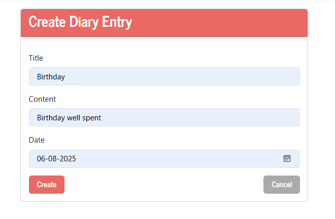

# 📓 Diary App (ASP.NET Core MVC - .NET 9)

A simple personal diary web application built with **ASP.NET Core MVC** and **Entity Framework Core**.  
It allows you to **Create**, **Read**, **Update**, and **Delete** diary entries.  
Uses **Microsoft SQL Server** as the database.

**Tutorial Link**:
<a href="https://youtu.be/SWdCMsLybQU?si=pcqjb30oT2mT51cX" target="_blank">
    ASP.NET 9 MVC Tutorial for Beginners - C# web development made easy
</a>

---

## ✨ Features

- ✅ Add new diary entries
- ✅ View all diary entries
- ✅ Edit existing entries
- ✅ Delete entries
- ✅ SQL Server database integration
- ✅ Bootstrap styling for responsive UI

---

## 🛠️ Tech Stack

- **Framework:** .NET 9 (Preview)
- **Frontend:** Razor Views + Bootstrap 5
- **Backend:** ASP.NET Core MVC
- **Database:** Microsoft SQL Server
- **ORM:** Entity Framework Core

---

## 🖥️ Screenshots

### Landing Page

---

### Entry Table Page

---

### Create Page

---

### Edit Page

---

### Delete Page

---
